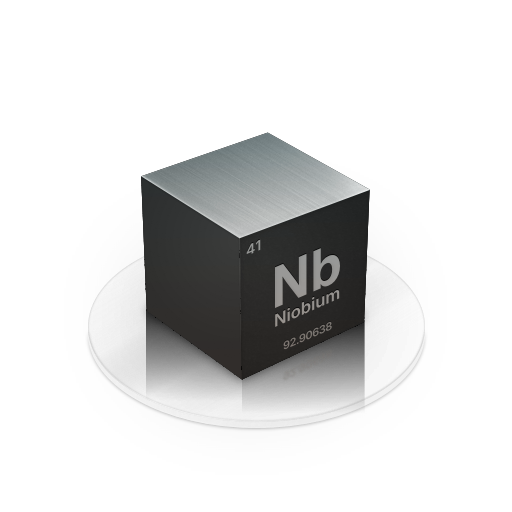

  

# Niobium
Niobium is a middle-level graphics API, built as a translation layer atop other graphics APIs
such as Metal and Vulkan. Niobium provides a more streamlined interface on top of these APIs
for 3D rendering, while also providing the flexibility needed by modern multimedia applications.

## Building Niobium
Niobium depends on the linker ordering guarantees of [redub](https://github.com/MrcSnm/redub) on Linux, 
it is recommended you use redub in general for Niobium.